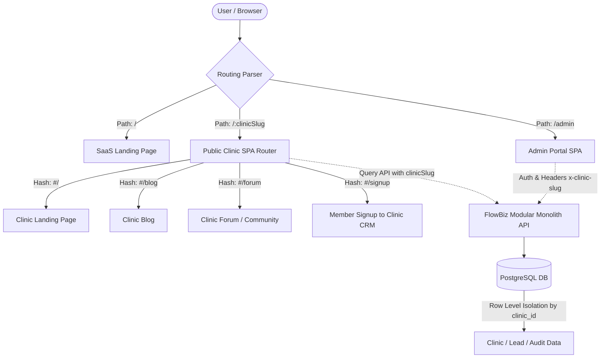

# Multi-Clinic SaaS Roadmap - FlowBiz Beauty

## Business Objective
FlowBiz Beauty กำลังปรับเปลี่ยนรูปแบบจากระบบ AI Marketing/Revenue Automation สำหรับคลินิกเดี่ยว (Single-Clinic Layer) ไปสู่การเป็น **Multi-Clinic SaaS Platform** ที่สมบูรณ์แบบ แพลตฟอร์มใหม่นี้จะช่วยให้:
1. **Super Admin** สามารถจัดการคลินิกทั้งหมดในระบบและเพิ่มคลินิกใหม่ได้อย่างสะดวกผ่าน UI เดียว
2. ให้บริการในรูปแบบ Multi-Tenant ภายใต้ URL หลัก ผ่านการเข้าถึงแบบ Path-Based Routing: `https://beauty.flowbiz.cloud/:clinicSlug`
3. หน้าแรก (`/`) ทำหน้าที่เป็น SaaS Landing Page หลักของ FlowBiz Beauty แนะนำฟีเจอร์สำหรับคลินิกและแพ็กเกจราคา
4. แต่ละคลินิกมีระบบย่อย เว็บไซต์หน้าบ้าน หน้าสมาชิก (Member Portal) คอนฟิก และฐานข้อมูลแยกอิสระ (Tenant Isolation)
5. เจ้าของคลินิก (Clinic Owner) และพนักงาน มีสิทธิ์เข้าถึง จัดการ และแก้ไขข้อมูลเฉพาะคลินิกตนเองเท่านั้น
6. สมาชิกลูกค้า (Member) สามารถสมัครสมาชิกผ่านหน้าเว็บของแต่ละคลินิก และข้อมูลจะถูกบันทึกเข้าสู่ CRM ของคลินิกนั้นโดยตรง
7. รองรับการขยายขอบเขตฟังก์ชันการทำงานส่วนบุคคลของแต่ละคลินิก เช่น LINE automation, AI CRM, HITL (Human-in-the-Loop), บริการ (Services), โปรโมชั่น (Promotions), แพ็กเกจ (Packages), การจองคิว (Booking) และเว็บบอร์ดชุมชน (Clinic Community)

---

## Current Repo Baseline
ปัจจุบันระบบมีรากฐานแบบ Multi-Tenant เบื้องต้นในระดับฐานข้อมูลและ API อยู่บ้างแล้ว:
* ตาราง `clinics`, `users`, และ `clinic_users` มีความสัมพันธ์กันเพื่อควบคุมการเข้าใช้ในระบบ (ตาม `002_multi_tenant_base.sql`)
* มีตาราง `workspaces` และ `workspace_memberships` (ตาม `018_workspace_memberships_invites.sql`) ที่ช่วยแยกพื้นที่ทำงานย่อยภายในคลินิก
* หน้าบ้านของคลินิก (`apps/web/src/public-app.jsx`) โหลดข้อมูลจาก API โดยใช้ `publicClinicId` ที่ผูกกับตัวแปรสภาพแวดล้อม (`PUBLIC_CLINIC_ID`) ทำให้รองรับเฉพาะการแสดงผลคลินิกเดียวตามที่คอมไพล์หรือตั้งค่าจาก Backend เท่านั้น
* เส้นทาง Admin และ API ตรวจสอบสิทธิ์ผ่าน `x-clinic-slug` และ `x-workspace-slug` ใน Header โดยยังไม่มีการควบคุมและแยกแยะสิทธิ์ข้ามคลินิกอย่างเด็ดขาดในระดับการเข้าถึง URL หน้าบ้านทั่วไป

---

## Target Multi-Clinic SaaS Architecture
โครงสร้างใหม่ของ FlowBiz Beauty SaaS จะมีลักษณะการทำงานร่วมกันดังแผนภาพด้านล่าง:

---

## URL / Routing Strategy
การเข้าถึง URL ในระบบ SaaS จะถูกแบ่งออกเป็น 3 โดเมนหลักตามเส้นทาง (Path-Based Routing):
1. **FlowBiz SaaS Main Landing Page**:
   * เข้าถึงผ่าน: `https://beauty.flowbiz.cloud/`
   * หน้าหลักเพื่อนำเสนอรายละเอียดแพลตฟอร์ม SaaS สำหรับผู้ที่สนใจเปิดคลินิก
2. **Clinic Public Pages (Path-Based)**:
   * เข้าถึงผ่าน: `https://beauty.flowbiz.cloud/:clinicSlug`
   * ทำหน้าที่เป็นหน้าเว็บประชาสัมพันธ์ บล็อกบทความ และเว็บบอร์ดชุมชนของคลินิกนั้นๆ
   * ภายในใช้ Hash Router ในการเปลี่ยนหน้าภายใน SPA เช่น:
     * `/:clinicSlug/#/` - หน้าแรกของคลินิก
     * `/:clinicSlug/#/blog` - หน้าบทความบล็อกของคลินิก
     * `/:clinicSlug/#/forum` - หน้ารายการเว็บบอร์ดถามตอบของคลินิก
     * `/:clinicSlug/#/signup` - หน้าสมัครสมาชิกของคลินิก
3. **Clinic Admin Portal**:
   * เข้าถึงผ่าน: `https://beauty.flowbiz.cloud/admin`
   * ประตูเข้าสู่ระบบบริหารจัดการ CRM และ AI Automation ของเจ้าของและพนักงานคลินิกทุกคน (ผู้ใช้จะถูกตรวจสิทธิ์และเปลี่ยนบริบทไปตาม Workspace ที่ตนสังกัดหลังการล็อกอิน)

---

## Tenant Isolation Rules
ความปลอดภัยในการแยกข้อมูลระหว่างคลินิก (Tenant Isolation) เป็นสิ่งสำคัญสูงสุด:
1. **ทุกตารางข้อมูลผู้เช่า (Tenant Data)** จะต้องมีคอลัมน์ `clinic_id` เพื่อระบุการเป็นเจ้าของข้อมูลอย่างชัดเจน
2. **ทุกเส้นทางคำขอ (API Routes)** ของ Clinic Owner และ Staff จะต้องรันผ่าน **Tenant Guard** ซึ่งมีหน้าที่:
   * ตรวจสอบว่าผู้ใช้มีสิทธิ์เข้าถึง `clinic_id` นั้นจริงตามความสัมพันธ์ในตาราง `clinic_users`
   * ป้องกันการสืบค้น ปรับปรุง หรือทำรายการใดๆ ข้ามไปคลินิกอื่น
3. **Super Admin** เท่านั้นที่มีสิทธิ์ดูข้อมูลข้ามคลินิกและใช้ API สรุปภาพรวมหรือรายงานระดับ Franchise/Platform ได้
4. การสร้าง **Clinic Slug** จะต้องมีกระบวนการตรวจสอบค่าให้ Unique เสมอ และต้องห้ามใช้คำที่ตรงกับ Reserved Routes (เช่น `admin`, `api`, `auth`, `tenant-context`, `live`, `ready`, `health`, `sitemap.xml`, `robots.txt`, `public.css`, `styles.css`)
5. คลินิกที่มีสถานะปิดชั่วคราวหรือไม่ได้เปิดใช้งาน (**Inactive Clinic**) จะต้องไม่แสดงหน้าเว็บของคลินิกแก่บุคคลทั่วไป โดยระบบจะแสดงหน้าแจ้งเตือนความไม่พร้อมใช้งานแทน

---

## Role Model
ระบบ SaaS จะรองรับบทบาทระดับแพลตฟอร์มและระดับคลินิกดังนี้:
* **Platform Level**:
  * **Super Admin**: ผู้ดูแลระบบสูงสุดของ FlowBiz Beauty จัดการโครงสร้างพื้นฐาน เพิ่ม/ระงับ คลินิก จัดการ Billing และดูวิเคราะห์ข้อมูลในระดับ Franchise
* **Clinic Level**:
  * **Clinic Owner**: ผู้ครอบครองสิทธิ์คลินิกเดี่ยว สามารถตั้งค่าข้อมูลคลินิก จัดการพนักงาน จัดการสิทธิ์ และเข้าถึงหน้าจอ CRM ทั้งหมดได้เฉพาะคลินิกตนเอง
  * **Staff (Manager, Sales, Marketing, Staff)**: สิทธิ์การเข้าถึง CRM และ AI Automation ภายในคลินิก ปฏิบัติตามนโยบาย RBAC ดั้งเดิมของแต่ละ Workspace
  * **Member / Customer**: ลูกค้าของคลินิกที่เข้าใช้งานผ่านหน้าบ้าน ไม่สามารถเข้าหน้าจอ CRM ได้ มีสิทธิ์แก้ไขข้อมูลโปรไฟล์ของตนเองและโพสต์/ตอบในเว็บบอร์ดชุมชนของคลินิกที่ตนสมัครสมาชิกเท่านั้น

---

## Super Admin Scope
* **Clinic Management**:
  * หน้าจัดการระบบสำหรับ Super Admin (ใช้สิทธิ์ `platform.super_admin` หรือบทบาทที่กำหนด)
  * คอนโซลสำหรับเพิ่มคลินิกใหม่ กำหนดสลัก (`clinicSlug`) ตั้งชื่อ เลือกแพ็กเกจ (Plan) และตั้งค่าสถานะ (`active` / `inactive`)
  * ปรับปรุงสถานะหรือระงับการใช้งานคลินิก
* **Platform Dashboard**:
  * แสดงสถิติและภาพรวมการใช้งานของทุกคลินิกในระบบ เช่น จำนวนลีดทั้งหมด จำนวนข้อความที่ส่ง และการประมวลผลงานของระบบอัตโนมัติ

---

## Clinic Owner Scope
* **Clinic Configuration**:
  * ตั้งค่าข้อมูลพื้นฐานของคลินิก เช่น ชื่อ ที่อยู่ เบอร์โทรศัพท์ และโซเชียลมีเดียลิงก์
  * จัดการผู้ใช้งานและพนักงานภายในคลินิก (เชิญสมาชิก ร่วมกับบทบาท)
  * จัดการข้อมูลและตั้งค่าเทมเพลตเว็บไซต์หน้าบ้านของคลินิกตนเอง
  * สิทธิ์เข้าถึงข้อมูลเป็นแบบ Single-Clinic Isolation ไม่เห็นข้อมูลของคลินิกอื่นเด็ดขาด

---

## Public Clinic Website Scope
* หน้าเว็บแสดงผลแบบ Dynamic ตาม `clinicSlug` ที่ระบุใน URL Path
* โหลด Config สี โลโก้ และเนื้อหาประชาสัมพันธ์ตามที่ Clinic Owner ตั้งค่าไว้
* **หน้าบริการและโปรโมชั่น (Services / Promotions / Packages)**:
  * แสดงรายการหัตถการความงาม ราคาพิเศษ และรายละเอียดเงื่อนไขของคลินิก
* **หน้ารายการบทความ (Blog List & Details)**:
  * บทความให้ความรู้ความงามและข่าวสารเฉพาะคลินิก
* **เว็บบอร์ดชุมชน (Forum List & Topic Details)**:
  * ลูกค้าสามารถตั้งคำถาม ปรึกษาปัญหาผิวพรรณ โดยระบุตัวตนหรือไม่ระบุตัวตนก็ได้ และทีมแพทย์ของคลินิกจะเป็นผู้เข้ามาตอบคำถาม

---

## Member Portal Scope
* หน้าสมัครสมาชิก (`/:clinicSlug/#/signup`) และหน้าโปรไฟล์สมาชิก
* ข้อมูลการสมัครสมาชิกทั้งหมดจะถูกบันทึกเชื่อมโยงกับ `clinic_id` เสมอ
* ลูกค้าสามารถเรียกดูภาพรวมสิทธิ์ ประวัติหัตถการ คะแนนสะสม และสถานะการจองของตนเองได้แบบเรียลไทม์

---

## CRM Integration Scope
* ลีด (Lead) และสมาชิก (Member) ที่บันทึกผ่านหน้าบ้านคลินิกใด จะวิ่งเข้าสู่ตาราง `leads` และ `customers` ของคลินิกนั้นโดยอัตโนมัติ โดยผูกค่า `clinic_id` อย่างถูกต้อง
* ทีมงานคลินิกสามารถบริหารจัดการข้อมูลลูกค้า ดูแลสถานะ Pipeline และทำกิจกรรมผ่านหน้าจอ CRM หลังบ้านได้ทันที

---

## LINE / AI / HITL Scope
* **LINE Official Account (OA)**:
  * คอนฟิกแยกตามคลินิก (แต่ละคลินิกตั้งค่า `LINE_CHANNEL_ACCESS_TOKEN` และ `LINE_CHANNEL_SECRET` ของตนเองผ่านหน้าจอบริหารจัดการ)
* **AI Copilot & Automation**:
  * การประเมินคะแนนลีดและวิเคราะห์คำแนะนำการบริการจะทำงานภายใต้บริบทข้อมูลของคลินิกตนเอง
* **Human-In-The-Loop (HITL) Gate**:
  * **กฎข้อบังคับด้านความปลอดภัย**: ข้อความที่สร้างโดย AI หรือมีเนื้อหาที่มีความเสี่ยงทางการแพทย์ (Medical Risk) จะต้องไม่ถูกส่งออกไปยังลูกค้าโดยอัตโนมัติ จะต้องส่งเข้ามาที่คิว `pending_approval` เพื่อให้ทีมงานคลินิกนั้นๆ ตรวจสอบและอนุมัติก่อนเสมอ
  * คิวอนุมัติ (Approval Queue) จะต้องแสดงผลเฉพาะงานที่เกี่ยวข้องกับพนักงานคลินิกนั้นๆ และบันทึกผู้ตรวจสอบ/ผู้อนุมัติแยกเป็นรายบุคคล

---

## Out-of-Scope For First Implementation Round
เพื่อความปลอดภัยและความคุ้มค่าในการพัฒนาในรอบแรก (Sprint แรกๆ) ฟังก์ชันต่อไปนี้จะยังไม่อยู่ในขอบเขตการทำงาน:
* ระบบการชำระเงินจริงและ Payment Gateway integration (เช่น Omise / Stripe) ให้ใช้การบันทึกสถานะชำระเงินแบบ Manual ไปก่อน
* การเชื่อมต่อโดเมนส่วนตัวของแต่ละคลินิก (Custom Domain Routing เช่น `https://mybeautyclinic.com` ชี้มาที่สลักคลินิก)
* ระบบจองคิวแพทย์ขั้นสูงที่มีการตรวจปฏิทินแบบเรียลไทม์กับตารางหมอ ให้ใช้ฟังก์ชันส่งความสนใจจองคิวมายัง CRM เผื่อพนักงานโทรกลับหรือแชทคุยแทน

---

## Recommended PR Breakdown
การพัฒนาเพื่อปรับเปลี่ยนระบบเป็น Multi-Clinic SaaS จะถูกแยกย่อยออกเป็น PR ขนาดเล็กเพื่อลดความเสี่ยงในการพังของระบบเดิม ดังนี้:

### Phase 1: Foundation & Validation (PR 0 - PR 2)
* **PR 0: Multi-Clinic SaaS Roadmap + Baseline** *(PR ปัจจุบัน)*
  * จัดทำเอกสารแนะแนวทาง โครงสร้างการเชื่อมต่อ แผนงาน และประเมินระบบเดิม (No runtime changes)
* **PR 1: Clinic Website Schema Extension**
  * เพิ่มคอลัมน์และตารางในฐานข้อมูลรองรับเว็บคอนฟิก สี โลโก้ และความเกี่ยวข้องของบทความ/ฟอรั่มกับคลินิก
* **PR 2: Reserved Slug + Clinic Validation**
  * พัฒนาระบบตรวจสอบ Reserved Words และความ Unique ของสลักก่อนการจัดเก็บในระดับ Backend

### Phase 2: Super Admin & Back-office Setup (PR 3 - PR 4)
* **PR 3: Super Admin Clinic API**
  * พัฒนา API สำหรับ Super Admin ในการสร้าง ปรับปรุง และดึงรายการคลินิกในระบบทั้งหมด
* **PR 4: Admin Clinics Menu + Add Clinic UI**
  * พัฒนาหน้าจอบน Admin SPA สำหรับ Super Admin ในการจัดการคลินิก

### Phase 3: Path-Based Routing & Landing (PR 5 - PR 7)
* **PR 5: Public Clinic Slug Resolver API**
  * พัฒนา API สำหรับค้นหาข้อมูลการตั้งค่าเว็บไซต์ของคลินิกโดยอิงจาก `clinicSlug`
* **PR 6: Public Routing Split `/` vs `/:clinicSlug`**
  * ปรับแต่ง Frontend Web Server เพื่อแยกการนำเสนอระหว่างหน้าแรกของ SaaS (`/`) และหน้าแรกคลินิก (`/:clinicSlug`)
* **PR 7: FlowBiz SaaS Landing Page**
  * พัฒนาหน้าแรก SaaS Landing Page สำหรับโปรโมตแพลตฟอร์ม

### Phase 4: Clinic Front-office V1 (PR 8 - PR 9)
* **PR 8: Clinic Website Template V1**
  * พัฒนาดีไซน์หน้าเว็บประชาสัมพันธ์ บล็อกบทความ และเว็บบอร์ดของคลินิกให้ดึง Config มาแสดงผลตามคลินิกที่เรียก
* **PR 9: Clinic Website Admin Editor**
  * เพิ่มเมนูการแก้ไขข้อมูลเว็บไซต์หน้าบ้านสำหรับ Clinic Owner

### Phase 5: Services & Memberships (PR 10 - PR 12)
* **PR 10: Services / Promotions / Packages**
  * พัฒนาเมนูและตารางสำหรับจัดการบริการหัตถการและราคาโปรโมชั่น
* **PR 11: Member Signup per Clinic**
  * พัฒนาหน้าสมัครสมาชิกภายใต้โดเมนคลินิก และผูกข้อมูลเข้า CRM
* **PR 12: Member Profile + CRM Timeline**
  * แสดงประวัติและข้อมูลส่วนตัวสมาชิกบนหน้าเว็บ และอัปเดตประวัติ CRM

### Phase 6: Interactive & Hardening (PR 13 - PR 16)
* **PR 13: Clinic Community / Forum per Clinic**
  * คัดกรองและแยกแยะหัวข้อเว็บบอร์ดแยกอิสระตามคลินิก
* **PR 14: Booking / Package Inquiry to CRM**
  * ระบบส่งคำขอความสนใจจองแพ็กเกจหรือบริการเข้าสู่ Pipeline CRM
* **PR 15: Tenant Isolation Hardening**
  * ปิดรอยรั่วความปลอดภัยทางเครือข่ายและระบบทดสอบตรวจจับข้อมูลข้ามคลินิก
* **PR 16: LINE / AI CRM / HITL per Clinic**
  * เปิดใช้งาน LINE Config และ AI Prompt แยกเป็นรายคลินิกและผูก HITL สมบูรณ์

---

## Risk Register
| รหัสความเสี่ยง | คำอธิบายความเสี่ยง | ผลกระทบ | ระดับความรุนแรง | มาตรการป้องกัน/บรรเทา |
| --- | --- | --- | --- | --- |
| **RSK-01** | สลักของคลินิกทับซ้อนกับเส้นทางระบบเดิม (เช่น `/admin` หรือ `/api`) | ระบบหลักพัง พนักงานใช้หลังบ้านไม่ได้ | สูงมาก | ใช้บัญชี Reserved Words ห้ามตั้งค่าสลักเหล่านี้ใน PR 2 |
| **RSK-02** | การหลุดของข้อมูลข้าม Tenant (Data Leakage) จากข้อบกพร่องใน SQL query | ผิดกฎหมายคุ้มครองข้อมูลส่วนบุคคล (PDPA) สูญเสียความน่าเชื่อถือ | สูงมาก | ใช้ Tenant Guard ครอบทุกคอนโทรลเลอร์ API และเพิ่มการทำ Unit Test ตรวจการรั่วไหลในทุกโมดูล |
| **RSK-03** | AI ทำงานอัตโนมัติในการตอบโต้ผู้ป่วยโดยตรงโดยไม่มีพนักงานอนุมัติ (Auto-sending Bypass) | เกิดความเสี่ยงต่อชีวิตผู้ป่วยหรือคำแนะนำทางการแพทย์ที่ผิดพลาด | สูงมาก | บังคับให้ AI-generated outbound messages วิ่งเข้าคิว HITL เสมอในระดับแกนหลัก (Core Layer) ห้ามหลีกเลี่ยง |
| **RSK-04** | สมาชิกโพสต์เนื้อหาที่เป็นโฆษณาชวนเชื่อหรือคำแนะนำการรักษาที่เป็นอันตรายบนฟอรั่ม | คลินิกและแพลตฟอร์มเสี่ยงต่อการโดนลงโทษทางกฎหมายการแพทย์ | สูง | มีระบบคัดกรองคำศัพท์ (Keyword filter) และให้มีปุ่มแจ้งลบ/อนุมัติกระทู้โดยแพทย์ผู้ดูแล |

---

## Acceptance Criteria For Each Phase
* **Phase 1 (Foundation)**:
  * รัน `npm run validate` และ `npm test` ผ่าน 100%
  * ตารางจัดเก็บข้อมูลเว็บไซต์มี Schema พร้อมใช้งาน และมีตัวกรองตรวจสอบ Reserved Slug
* **Phase 2 (Admin Portal)**:
  * Super Admin สามารถกดเพิ่มคลินิกผ่านหน้าบ้านและได้สลักที่เป็น Unique
* **Phase 3 (Routing)**:
  * เข้าใช้ `/` เจอ SaaS Landing Page และเข้า `/:clinicSlug` นำเสนอหน้าสำหรับคลินิกนั้น
  * ไม่มีหน้าเว็บใดพังหรือดึงข้อมูลสับสนกัน
* **Phase 4 (Front-office)**:
  * การแก้ไขสี โลโก้ และเนื้อหาของคลินิก A จะต้องแสดงผลถูกต้องและไม่ไปรบกวนคลินิก B
* **Phase 5 (Services & Members)**:
  * ลีดที่ลงทะเบียนสมัครสมาชิกจากหน้าเว็บคลินิก A ต้องวิ่งเข้าสู่ CRM ของคลินิก A เท่านั้น พนักงานคลินิก B ต้องมองไม่เห็น
* **Phase 6 (Hardening & Integrations)**:
  * การจำลองแชทผ่าน LINE OA และการตอบโต้ของ AI ต้องเข้า HITL ของพนักงานคลินิกนั้นๆ และบันทึกประวัติการตรวจสอบอย่างครบถ้วน
